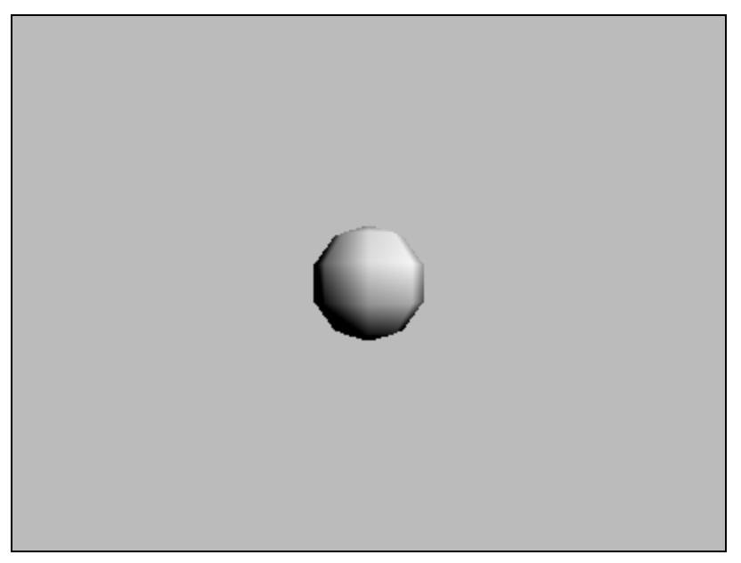

# three.js-custom-shader

Basic setup for three.js custom shaders.

Open [`index.html`](index.html).

To modify the shader, edit `vertexShaderSource` and `fragmentShaderSource` in [`js/main.js`](js/main.js).